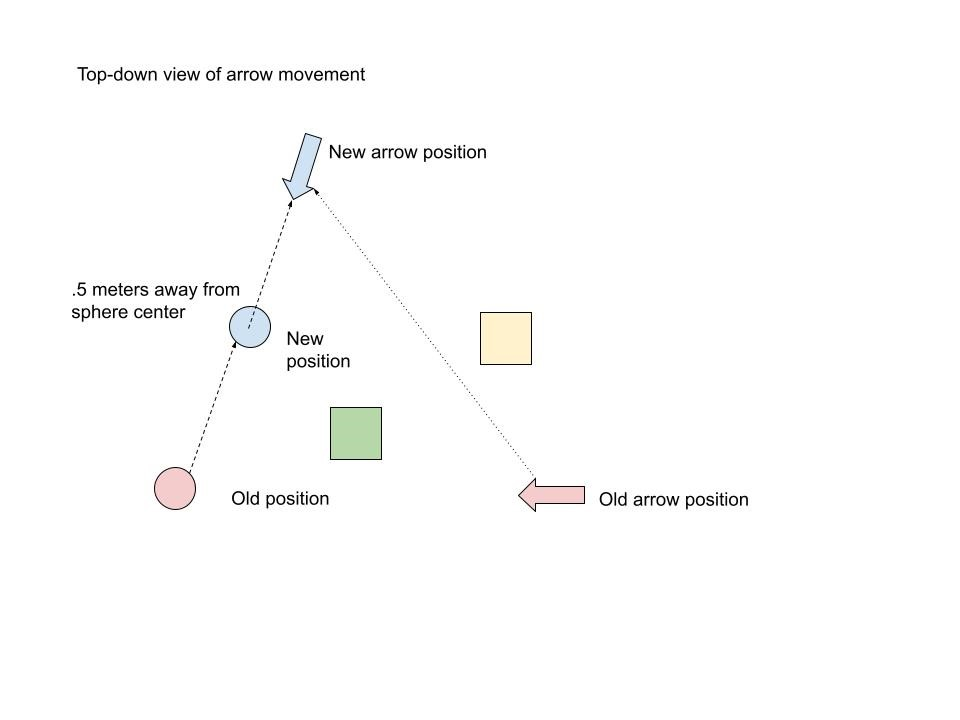

# Marxent Labs Take-Home Test

## Problem Statement

Please use BabylonJS as your rendering engine.

Create 3 shapes in the scene. 
 - A sphere, 
 - a 3-dimensional arrow, and 
 - a box. 
 
 The sphere should be draggable via mouse along the X and Z axis of the scene. 
 
 After a user completes the drag, the arrow should automatically move (over time, as in an animation) so that it is exactly .5 meters away from the sphere's new position along the path of movement (as determined by new position minus old position; see diagram).

The box should remain static at a position of 0,0,0. As you can see in the diagram, a triangle is formed by following points
1.	The arrow's old position
2.	The arrow's new position
3.	The sphere's old position

After the arrow complete's movement, if the box is within the triangle formed by the preceding three points, the box should turn green. Otherwise, the box should turn yellow.

Please submit as an self-contained zip file. You may either keep it as simple as an index.html and index.js, or you may use webpack/npm so that the site may be viewable using "npm start".

## Notes

 - How should the canvas fit in the page? Should it be fully-covering, or have room for other content around it?
   - I'm assuming it should have room for other content, because that's generally harder to do right, but generalizes to the full-page experience.
 - Should there be visual feedback when the user has hovered over the object? 
   - I'm assuming yes. More feedback is usually good.
 - Should there be audio feedback with user interactions?
   - Stretch goal
 - Where should the camera be located? Should the camera be movable?
   - No, keep it simple.
 - How should the scene be lit? Dramatic real-time spotlighting? Soft, low-key lighting with high ambient? 
   - Soft lighting is probably more usable in editor-like interfaces.
 - Should there be a ground plane?
   - Yes, and it should have shadows for the objects, to help judge the 3D movement.
 - How should the arrow be created? A cone and a cylinder? gLTF 3D model?
   - Models are more easily modifiable.
 - Should it support touch-screen interaction?
   - Might as well, it's not that much more work.
- I'm finding that each of the features of the test has a specific BabylonJS feature that fulfills it, whereas in Three.js I'd have to do things more manually. So I'm starting from the assumption "oh, I need to do X to get this done" and then finding that there isn't an easy way to do it that way. But I don't have awareness of the existence of all the features of BabylonJS, so it's a little difficult to figure out the right approach.

## Tasks

 - [x] Create stub page with canvas
 - [x] Get BabylonJS running
 - [x] Add a sphere to the scene
 - [x] Make window resizing work right
 - [ ] <strike>Wire up basic pointer events</strike> (BabylonJS has its own event system)
 - [ ] <strike>Figure out raycasting in BabylonJS</strike> (BabylonJS has pointer behaviors of its own)
 - [ ] <strike>Create a simple event system</strike> (BabylonJS has its own event system)
 - [x] Make the sphere draggable in the X/Z axes
 - [x] Add a cube
 - [x] Add shadows
 - [x] Figure out gLTF loading in BabylonJS
 - [x] Model an arrow and load it into the scene
 - [ ] Move the arrow after the sphere is moved
 - [ ] Point the arrow at the sphere
 - [ ] Lerp/slerp the arrow pose
 - [ ] Perform the triangle test
 - [ ] Make the sphere highlight on hover. Bump the size a little and outline it
 - [ ] Make the arrow and box dim/go translucent on hover (indicating not interactive)
 - [ ] (Optional) Create buttons to switch between top-down and in-scene camera angle
 - [ ] (Optional) Animate camera pose
 - [ ] (Optional) Add scroll ticking sound while dragging the sphere
 - [ ] (Optional) add pop sound when arrow finishes moving